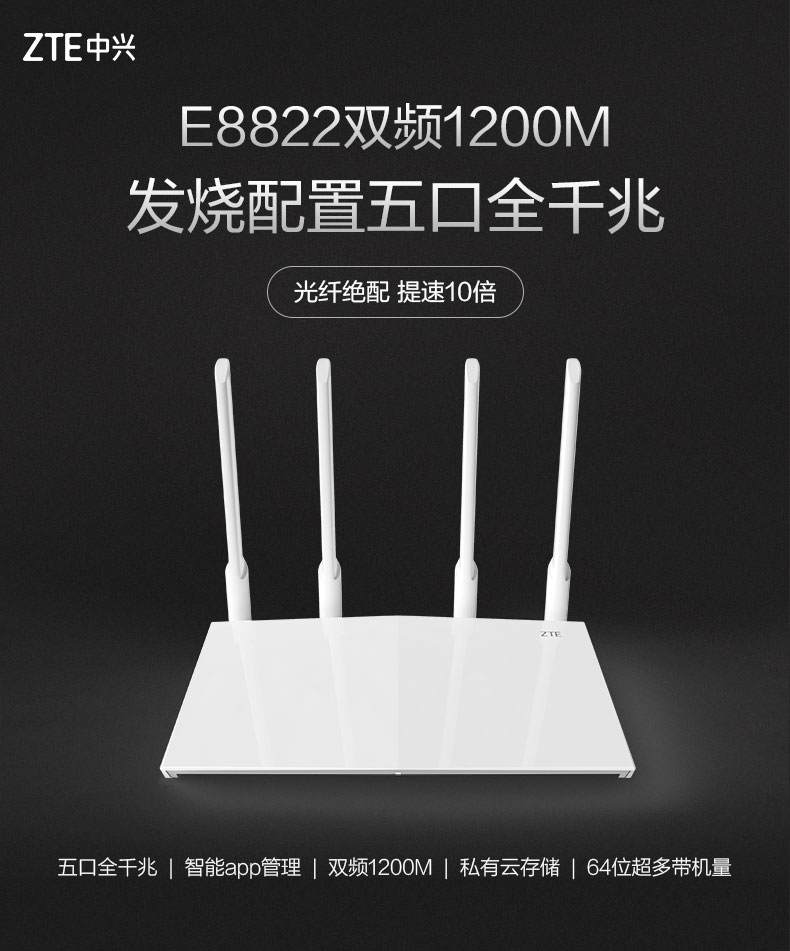
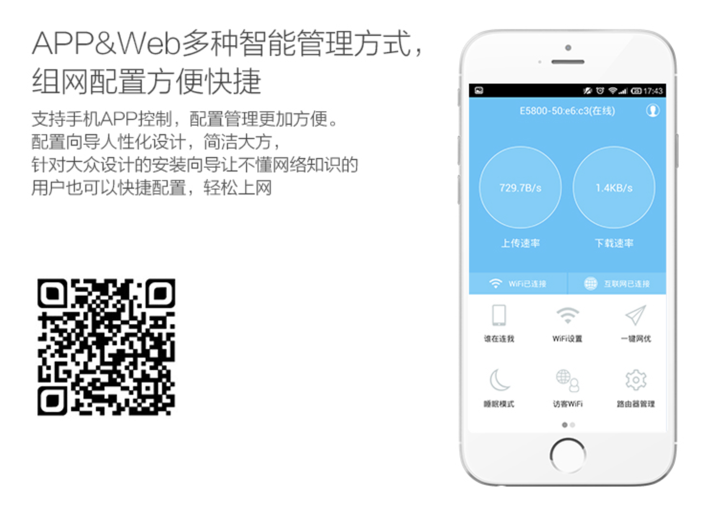
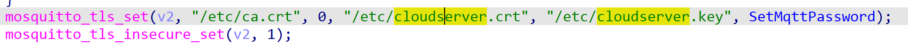
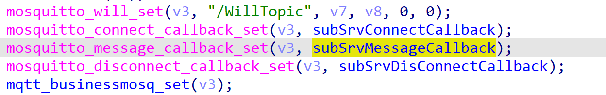
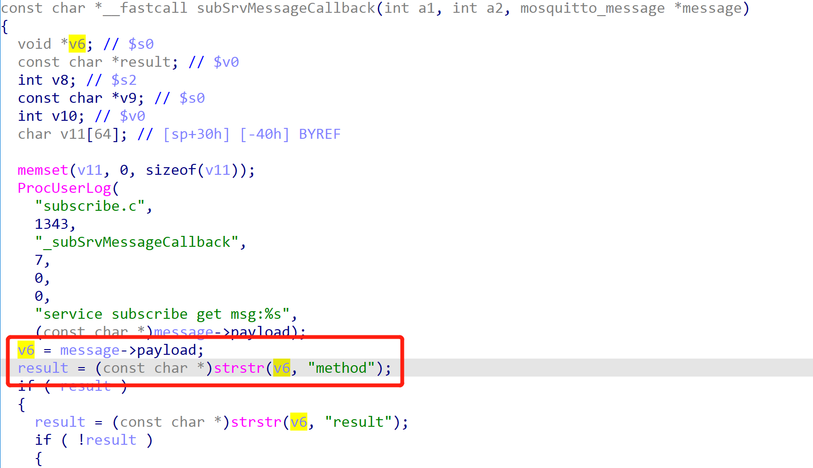

# ZTE Router E8810/E8820/E8822 MQTT service DoS

There is a null pointer dereference vulnerability in ZTE routers.

Affected products: including ZTE [E8810](https://www.ztehome.com.cn/index.php/8-wuxianluyouqi/26-e8810)/E8820/[E8822](https://www.ztehome.com.cn/index.php/8-wuxianluyouqi/41-e8822).

  

## Vulnerability Description

Users can use APP to control these routers. The protocol between APP and router is MQTT.  /bin/mqtt subscribes to control messages from ZTE MQTT Server, APP publishes control messages to the device through the MQTT server. 

### Hardcoded MQTT Credential

Due to the hardcoded MQTT credential, attackers can get credential by extracting router firmware using binwalk, and then publish malicious data to routers.

### Null Pointer Dereference

/bin/mqtt subscribes to control messages, and calls subSrvMessageCallback function to handle messages when new messages come.  

MQTT message include two parts: topic and payload.  subSrvMessageCallback function gets payload in MQTT message first, and then calls strstr function immediately to determine if the payload contains "method" string.

v6 is the pointer of MQTT payload. If the payload is empty, the value of v6 is 0 and this brings a null pointer dereference when calls strstr, and then process mqtt will crash. 

If the attacker keeps publishing empty payload,  users cannot use app to control their routers, which causes a DoS attack.

